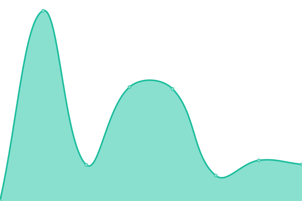

# [📈 Live Status](https://g33k247.github.io/awesome_uptime): <!--live status--> **🟧 Partial outage**

This repository contains the open-source uptime monitor and status page for [John S. Galliano](https://g33k247.github.io/awesome_uptime), powered by [Upptime](https://github.com/upptime/upptime).

With [Upptime](https://upptime.js.org), you can get your own unlimited and free uptime monitor and status page, powered entirely by a GitHub repository. We use [Issues](https://github.com/g33k247/awesome_uptime/issues) as incident reports, [Actions](https://github.com/g33k247/awesome_uptime/actions) as uptime monitors, and [Pages](https://g33k247.github.io/awesome_uptime) for the status page.

<!--start: status pages-->
<!-- This summary is generated by Upptime (https://github.com/upptime/upptime) -->
<!-- Do not edit this manually, your changes will be overwritten -->
<!-- prettier-ignore -->
| URL | Status | History | Response Time | Uptime |
| --- | ------ | ------- | ------------- | ------ |
|  [Google](https://www.google.com) | 🟩 Up | [google.yml](https://github.com/g33k247/awesome_uptime/commits/HEAD/history/google.yml) | 

 86ms
     
 | 

<a href="https://g33k247.github.io/awesome_uptime/history/google">100.00%</a>
    

|  [Hacker News](https://news.ycombinator.com) | 🟩 Up | [hacker-news.yml](https://github.com/g33k247/awesome_uptime/commits/HEAD/history/hacker-news.yml) | 

 349ms
     
 | 

<a href="https://g33k247.github.io/awesome_uptime/history/hacker-news">100.00%</a>
    

|  [Linux Handbook](https://linuxhandbook.com) | 🟩 Up | [linux-handbook.yml](https://github.com/g33k247/awesome_uptime/commits/HEAD/history/linux-handbook.yml) | 

 634ms
     
 | 

<a href="https://g33k247.github.io/awesome_uptime/history/linux-handbook">99.90%</a>
    

|  [WGU](https://www.wgu.edu) | 🟩 Up | [wgu.yml](https://github.com/g33k247/awesome_uptime/commits/HEAD/history/wgu.yml) | 

 159ms
     
 | 

<a href="https://g33k247.github.io/awesome_uptime/history/wgu">100.00%</a>
    

|  [Microsoft](https://www.microsoft.com) | 🟥 Down | [microsoft.yml](https://github.com/g33k247/awesome_uptime/commits/HEAD/history/microsoft.yml) | 

 90ms
     
 | 

<a href="https://g33k247.github.io/awesome_uptime/history/microsoft">0.00%</a>
    

|  [VPNunlimited](https://my.keepsolid.com/) | 🟩 Up | [vp-nunlimited.yml](https://github.com/g33k247/awesome_uptime/commits/HEAD/history/vp-nunlimited.yml) | 

 1204ms
     
 | 

<a href="https://g33k247.github.io/awesome_uptime/history/vp-nunlimited">100.00%</a>
    

<!--end: status pages-->

[**Visit our status website →**](https://g33k247.github.io/awesome_uptime)

## 📄 License

- Powered by: [Upptime](https://github.com/upptime/upptime)
- Code: [MIT](./LICENSE) © [John S. Galliano](https://g33k247.github.io/awesome_uptime)
- Data in the `./history` directory: [Open Database License](https://opendatacommons.org/licenses/odbl/1-0/)
